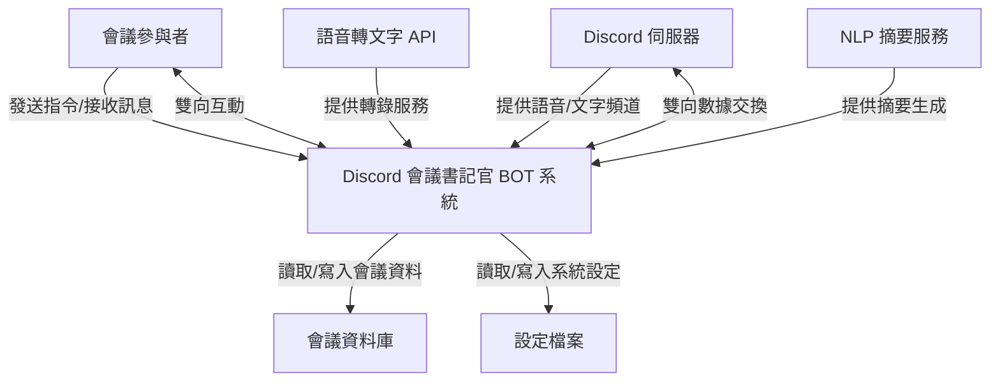
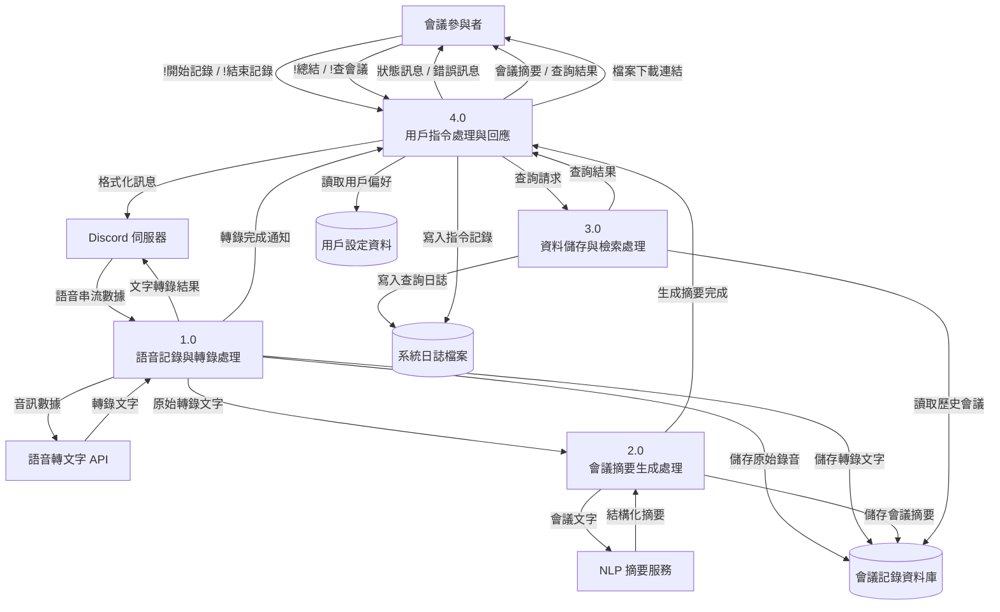

```mermaid


graph TD
    %% 外部實體
    A[會議參與者] -->|發送指令/接收訊息| S
    B[Discord 伺服器] -->|提供語音/文字頻道| S
    C[語音轉文字 API] -->|提供轉錄服務| S
    D[NLP 摘要服務] -->|提供摘要生成| S
    
    %% 主要系統
    S[Discord 會議書記官 BOT 系統]
    
    %% 數據存儲
    S -->|讀取/寫入會議資料| E[會議資料庫]
    S -->|讀取/寫入系統設定| F[設定檔案]
    
    %% 雙向數據流
    A <-->|雙向互動| S
    B <-->|雙向數據交換| S


```

```mermaid
graph TD
    %% 外部實體
    USER[會議參與者]
    DISCORD[Discord 伺服器]
    STT_API[語音轉文字 API]
    NLP_API[NLP 摘要服務]
    
    %% 主要處理程序
    P1[1.0<br/>語音記錄與轉錄處理]
    P2[2.0<br/>會議摘要生成處理]
    P3[3.0<br/>資料儲存與檢索處理]
    P4[4.0<br/>用戶指令處理與回應]
    
    %% 數據存儲
    D1[(會議記錄資料庫)]
    D2[(用戶設定資料)]
    D3[(系統日誌檔案)]
    
    %% 數據流 - 用戶交互
    USER -->|!開始記錄 / !結束記錄| P4
    USER -->|!總結 / !查會議| P4
    P4 -->|狀態訊息 / 錯誤訊息| USER
    P4 -->|會議摘要 / 查詢結果| USER
    P4 -->|檔案下載連結| USER
    
    %% 數據流 - Discord 交互
    DISCORD -->|語音串流數據| P1
    P1 -->|文字轉錄結果| DISCORD
    P4 -->|格式化訊息| DISCORD
    
    %% 數據流 - 外部 API 調用
    P1 -->|音訊數據| STT_API
    STT_API -->|轉錄文字| P1
    P2 -->|會議文字| NLP_API
    NLP_API -->|結構化摘要| P2
    
    %% 數據流 - 處理程序間
    P1 -->|原始轉錄文字| P2
    P1 -->|轉錄完成通知| P4
    P2 -->|生成摘要完成| P4
    
    %% 數據流 - 數據存儲
    P1 -->|儲存原始錄音| D1
    P1 -->|儲存轉錄文字| D1
    P2 -->|儲存會議摘要| D1
    P3 -->|讀取歷史會議| D1
    P3 -->|寫入查詢日誌| D3
    P4 -->|讀取用戶偏好| D2
    P4 -->|寫入指令記錄| D3
    
    %% 數據流 - 查詢處理
    P4 -->|查詢請求| P3
    P3 -->|查詢結果| P4
```
