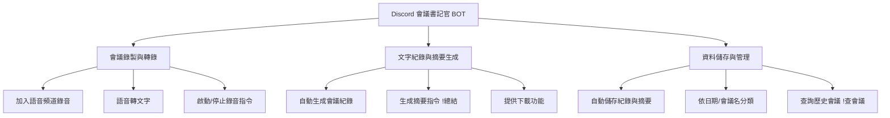
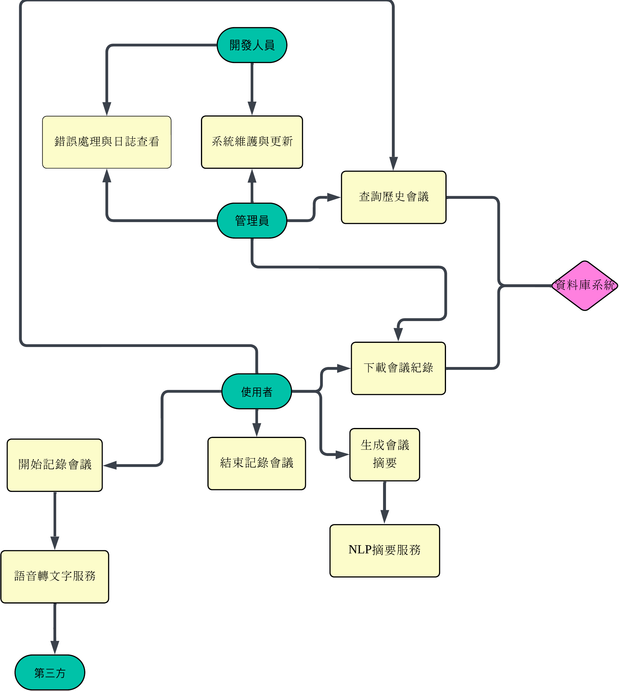

# Discord 會議書記官 BOT

### 一、功能性需求（Functional Requirements）
#### 1.會議錄製與轉錄
##### 機器人可加入 Discord 語音頻道並錄製會議語音。
##### 將語音即時轉換為文字（Speech-to-Text）。
##### 可依指令（如 !開始記錄 / !結束記錄）啟動或停止錄音。

#### 2.文字紀錄與摘要生成功能
##### 自動生成結構化的會議紀錄，包含「主題、要點、決議、待辦事項」。
##### 使用指令（如 !總結）時，生成摘要並貼回 Discord 頻道。
##### 提供下載文字紀錄檔（.txt / .pdf）。

#### 3.資料儲存與檔案管理
##### 自動保存每次會議的轉錄文字與摘要至伺服器資料夾或資料庫。
##### 依日期或會議名稱建立檔案結構，方便查詢與管理。
##### 提供歷史會議查詢功能（例如 !查會議 2025-10-05）。

### 二、非功能性需求（Non-Functional Requirements）
#### 1.效能（Performance）
##### 語音轉文字延遲應低於 3 秒。
##### 系統應能同時支援至少 10 個伺服器運行。
##### 生成會議摘要時間應少於 5 秒。

#### 2.可維護性（Maintainability）
##### 程式碼模組化設計，方便日後更新（語音模組 / NLP 模組 / 儲存模組分離）。
##### 記錄錯誤日誌與例外事件，方便除錯與維護。
##### 文件化（提供 README 與安裝說明）。

#### 3.安全性與可靠性（Security & Reliability）
##### 採用 OAuth2 驗證 Discord BOT 權限。
##### 確保所有語音與文字資料僅儲存在授權伺服器中。
##### 系統運行時間（uptime）應達 99%。
### 功能分解圖

### 使用案例圖

### 使用案例說明
#### 使用案例 1：會議錄製與轉錄
| 項目        | 說明                                                                                   |
| --------- | ------------------------------------------------------------------------------------ |
| **主要參與者** | 使用者                                                                                  |
| **目標**    | 錄製會議語音並轉換成文字紀錄。                                                                      |
| **前置條件**  | BOT 已加入伺服器並擁有語音頻道權限。                                                                 |
| **後置條件**  | 產生文字紀錄檔，存入伺服器資料夾。                                                                    |
| **主要流程**  | 1. 使用者輸入 `!開始記錄` 2. BOT 開始錄音 3. 即時轉錄語音文字 4. 使用者輸入 `!結束記錄` 5. BOT 儲存轉錄檔案。 |
#### 使用案例 2：生成摘要
| 項目        | 說明                                                                        |
| --------- | ------------------------------------------------------------------------- |
| **主要參與者** | 使用者                                                                       |
| **目標**    | 自動生成包含主題、要點、決議、待辦事項的摘要。                                                   |
| **前置條件**  | 已有可用的文字紀錄。                                                                |
| **後置條件**  | 摘要貼回 Discord 頻道並可下載。                                                      |
| **主要流程**  | 1. 使用者輸入 `!總結` 2. 系統讀取最新會議紀錄 3. NLP 模組生成摘要 4. BOT 貼出摘要訊息並提供下載連結。 |
#### 使用案例 3：查詢歷史會議
| 項目        | 說明                                                                 |
| --------- | ------------------------------------------------------------------ |
| **主要參與者** | 使用者                                                                |
| **目標**    | 依日期或名稱查詢歷史會議紀錄。                                                    |
| **前置條件**  | 系統內已有儲存的會議資料。                                                      |
| **後置條件**  | 回傳指定日期的會議摘要或全文。                                                    |
| **主要流程**  | 1. 使用者輸入 `!查會議 2025-10-05` 2. 系統搜尋會議資料夾 3. BOT 傳回該會議紀錄與摘要檔案。 |
