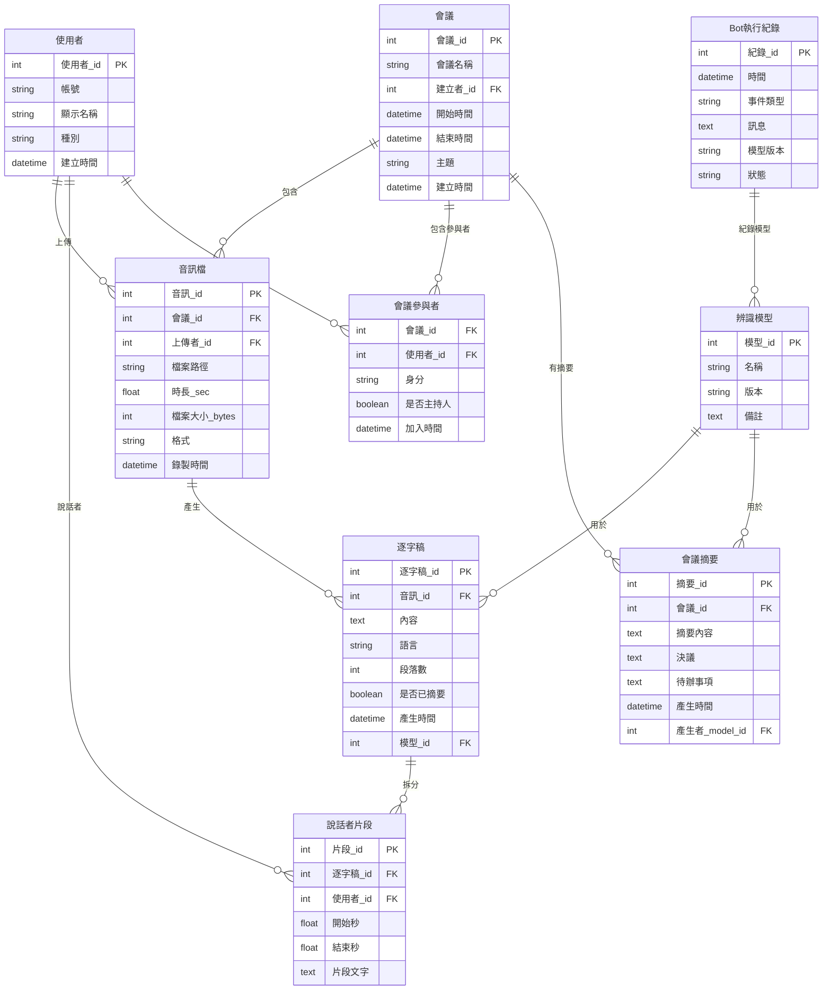

```mermaid
erDiagram
    %% 實體（中文欄位與建議擴充欄位）
    使用者 {
        int 使用者_id PK
        string 帳號
        string 顯示名稱
        string 種別
        datetime 建立時間
    }

    會議 {
        int 會議_id PK
        string 會議名稱
        int 建立者_id FK
        datetime 開始時間
        datetime 結束時間
        string 主題
        datetime 建立時間
    }

    音訊檔 {
        int 音訊_id PK
        int 會議_id FK
        int 上傳者_id FK
        string 檔案路徑
        float 時長_sec
        int 檔案大小_bytes
        string 格式
        datetime 錄製時間
    }

    逐字稿 {
        int 逐字稿_id PK
        int 音訊_id FK
        text 內容
        string 語言
        int 段落數
        boolean 是否已摘要
        datetime 產生時間
        int 模型_id FK
    }

    會議參與者 {
        int 會議_id FK
        int 使用者_id FK
        string 身分
        boolean 是否主持人
        datetime 加入時間
        %% 組合實體：複合主鍵 (會議_id, 使用者_id)
    }

    說話者片段 {
        int 片段_id PK
        int 逐字稿_id FK
        int 使用者_id FK
        float 開始秒
        float 結束秒
        text 片段文字
        %% 組合實體：連結逐字稿與使用者以標示說話區段
    }

    會議摘要 {
        int 摘要_id PK
        int 會議_id FK
        text 摘要內容
        text 決議
        text 待辦事項
        datetime 產生時間
        int 產生者_model_id FK
    }

    辨識模型 {
        int 模型_id PK
        string 名稱
        string 版本
        text 備註
    }

    Bot執行紀錄 {
        int 紀錄_id PK
        datetime 時間
        string 事件類型
        text 訊息
        string 模型版本
        string 狀態
    }

    %% 關聯（中文標籤）
    使用者 ||--o{ 音訊檔 : "上傳"
    會議 ||--o{ 音訊檔 : "包含"
    音訊檔 ||--o{ 逐字稿 : "產生"
    逐字稿 ||--o{ 說話者片段 : "拆分"
    使用者 ||--o{ 說話者片段 : "說話者"
    使用者 ||--o{ 會議參與者 : "加入"
    會議 ||--o{ 會議參與者 : "包含參與者"
    會議 ||--o{ 會議摘要 : "有摘要"
    辨識模型 ||--o{ 逐字稿 : "用於"
    辨識模型 ||--o{ 會議摘要 : "用於"
    Bot執行紀錄 ||--o{ 辨識模型 : "紀錄模型"
```
