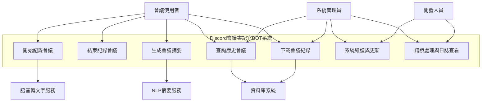

# Discord 會議書記官 BOT

### 一、功能性需求（Functional Requirements）
#### 1.會議錄製與轉錄
##### 機器人可加入 Discord 語音頻道並錄製會議語音。
##### 將語音即時轉換為文字（Speech-to-Text）。
##### 可依指令（如 !開始記錄 / !結束記錄）啟動或停止錄音。

#### 2.文字紀錄與摘要生成功能
##### 自動生成結構化的會議紀錄，包含「主題、要點、決議、待辦事項」。
##### 使用指令（如 !總結）時，生成摘要並貼回 Discord 頻道。
##### 提供下載文字紀錄檔（.txt / .pdf）。

#### 3.資料儲存與檔案管理
##### 自動保存每次會議的轉錄文字與摘要至伺服器資料夾或資料庫。
##### 依日期或會議名稱建立檔案結構，方便查詢與管理。
##### 提供歷史會議查詢功能（例如 !查會議 2025-10-05）。

### 二、非功能性需求（Non-Functional Requirements）
#### 1.效能（Performance）
##### 語音轉文字延遲應低於 3 秒。
##### 系統應能同時支援至少 10 個伺服器運行。
##### 生成會議摘要時間應少於 5 秒。

#### 2.可維護性（Maintainability）
##### 程式碼模組化設計，方便日後更新（語音模組 / NLP 模組 / 儲存模組分離）。
##### 記錄錯誤日誌與例外事件，方便除錯與維護。
##### 文件化（提供 README 與安裝說明）。

#### 3.安全性與可靠性（Security & Reliability）
##### 採用 OAuth2 驗證 Discord BOT 權限。
##### 確保所有語音與文字資料僅儲存在授權伺服器中。
##### 系統運行時間（uptime）應達 99%。

```mermaid
graph TD
    A[Discord 會議書記官 BOT 系統] --> B1[會議管理模組]
    A --> B2[文字處理模組]
    A --> B3[資料管理模組]
    A --> B4[系統管理模組]
    A --> B5[用戶介面模組]

    %% 會議管理模組分解
    B1 --> C1[語音錄製功能]
    B1 --> C2[語音轉文字功能]
    B1 --> C3[會議控制功能]
    
    C1 --> D1[加入語音頻道]
    C1 --> D2[音訊串流處理]
    C1 --> D3[音訊格式轉換]
    
    C2 --> D4[即時語音辨識]
    C2 --> D5[批次轉錄處理]
    C2 --> D6[文字校對與修正]
    
    C3 --> D7[開始記錄指令 !開始記錄]
    C3 --> D8[結束記錄指令 !結束記錄]
    C3 --> D9[暫停/繼續控制]

    %% 文字處理模組分解
    B2 --> C4[會議摘要生成]
    B2 --> C5[結構化紀錄建立]
    B2 --> C6[文字分析功能]
    
    C4 --> D10[關鍵要點提取]
    C4 --> D11[決議事項識別]
    C4 --> D12[待辦事項整理]
    
    C5 --> D13[會議模板應用]
    C5 --> D14[時間標記插入]
    C5 --> D15[發言者識別]
    
    C6 --> D16[文字清理與格式化]
    C6 --> D17[關鍵詞提取]
    C6 --> D18[語意分析]

    %% 資料管理模組分解
    B3 --> C7[資料儲存功能]
    B3 --> C8[檔案管理功能]
    B3 --> C9[查詢檢索功能]
    
    C7 --> D19[會議資料庫操作]
    C7 --> D20[用戶設定儲存]
    C7 --> D21[系統日誌記錄]
    
    C8 --> D22[檔案分類與組織]
    C8 --> D23[匯出功能 TXT/PDF]
    C8 --> D24[備份與還原]
    
    C9 --> D25[歷史會議查詢 !查會議]
    C9 --> D26[關鍵字搜尋]
    C9 --> D27[時間範圍查詢]

    %% 系統管理模組分解
    B4 --> C10[權限管理]
    B4 --> C11[系統監控]
    B4 --> C12[維護功能]
    
    C10 --> D28[Discord OAuth2 驗證]
    C10 --> D29[角色權限檢查]
    C10 --> D30[存取控制]
    
    C11 --> D31[效能監控]
    C11 --> D32[錯誤追蹤]
    C11 --> D33[使用統計]
    
    C12 --> D34[系統更新]
    C12 --> D35[資料庫維護]
    C12 --> D36[服務健康檢查]

    %% 用戶介面模組分解
    B5 --> C13[指令處理]
    B5 --> C14[訊息回應]
    B5 --> C15[檔案傳輸]
    
    C13 --> D37[指令解析與驗證]
    C13 --> D38[參數處理]
    C13 --> D39[指令權限驗證]
    
    C14 --> D40[格式化訊息生成]
    C14 --> D41[即時狀態回報]
    C14 --> D42[錯誤訊息處理]
    
    C15 --> D43[檔案上傳至 Discord]
    C15 --> D44[下載連結生成]
    C15 --> D45[檔案壓縮處理]
```

