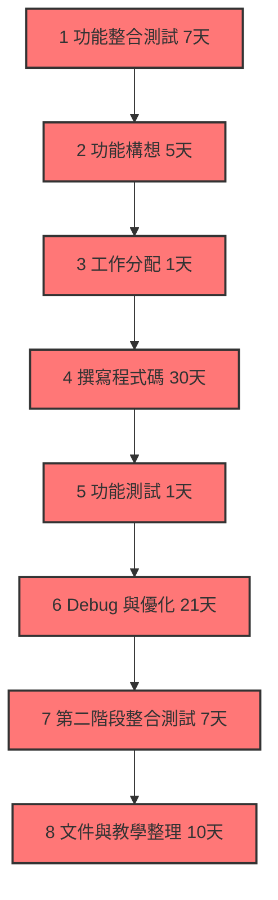
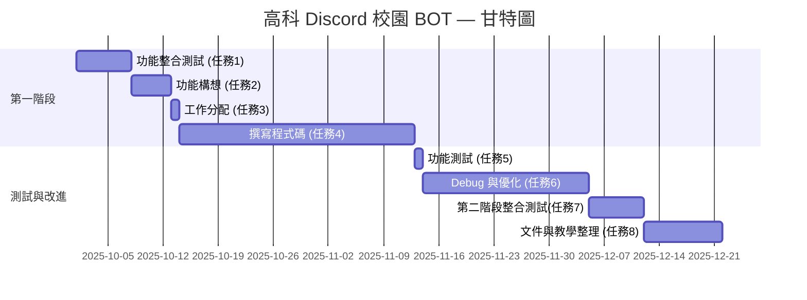

# 工作分配
#####　任務1 第一階段功能整合測試 7天
#####  任務2 第二階段功能構想 5天
#####  任務3 工作分配 1天
#####  任務4 撰寫程式碼 30天
#####  任務5 功能測試 1天
#####  任務6 Debug 與優化 21天
#####  任務7 第二階段功能整合測試 7天
#####  任務8 撰寫文件與教學整理 10天

##### 組長 C112118249 鄭宇哲 ：任務1、7功能整合，任務3、任務4(功能A)

### 1. PERT/CPM 圖

### 2. 甘特圖

