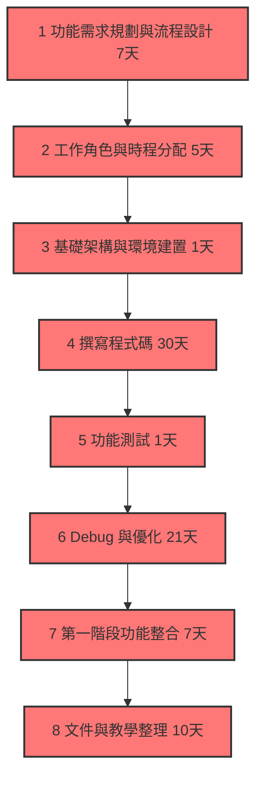
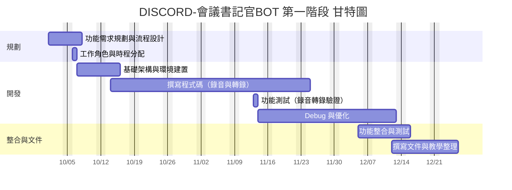

# 工作分配

#####  任務1 功能需求規劃與流程設計 5天（確認功能列表：錄音、轉錄、儲存、指令觸發等）
#####  任務2 工作角色與時程分配 1天
#####  任務3 基礎架構與環境建置 7天（設定 BOT、連接 Discord API、基本伺服器架設）
#####  任務4 撰寫程式碼 30天
#####  任務5 功能測試 1天
#####  任務6 Debug 與優化 21天
#####  任務7 第一階段功能整合 7天
#####  任務8 撰寫文件與教學整理 10天
#  
#  
#  
#  
#  
#  
##### 組長 C112118249 鄭宇哲 ：任務1、任務3、任務4、進度追蹤
##### 組員 C112118229 吳昰嶧 ：任務2、任務4、任務6
##### 組員 C112118236 葉承翰 ：任務4、任務5、任務6
##### 組員 C112118235 林哲玄 ：任務4、任務7、任務8
#
#
#
#
#
### 1. PERT/CPM 圖

### 2. 甘特圖

