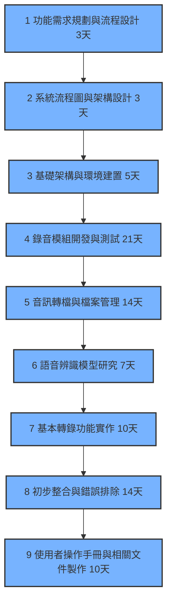
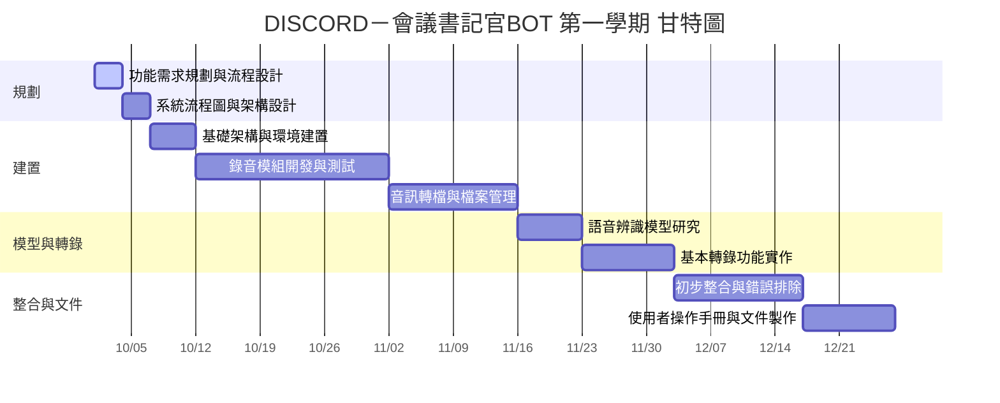

# 工作分配

#####  任務1 功能需求規劃與流程設計 3天（確認功能列表：錄音、轉錄、儲存、指令觸發等）
#####  任務2 系統流程圖與架構設計　3天
#####  任務3 基礎架構與環境建置 5天（設定 Discord Bot、建立開發環境與版本控管，測試指令連線與語音頻道進入功能）
#####  任務4 錄音模組開發與測試　21天（撰寫錄音程式，實作分軌錄音，測試多位使用者同時講話的錄音穩定度）
#####  任務5 音訊轉檔與檔案管理　14天（使用 ffmpeg 批次將音檔轉為 16kHz mono，建立自動命名與分類儲存流程）
#####  任務6　語音辨識模型研究　7天(比較 Whisper 與 Vosk 的執行速度與準確率)
#####  任務7 基本轉錄功能實作　10天（實作可離線執行的語音轉文字流程，產出初步逐字稿）
#####  任務8 初步整合與錯誤排除　14天
#####  任務9 使用者操作手冊和相關文件製作 10天
#  
#  
#  
#  
#  
#  
##### 組長 C112118249 鄭宇哲 ：任務1、任務2、任務3、任務8、進度追蹤
##### 組員 C112118229 吳昰嶧 ：任務4、任務5、任務8
##### 組員 C112118236 葉承翰 ：任務6、任務7、任務8
##### 組員 C112118235 林哲玄 ：任務1、任務7、任務9
#
#
#
#
#
### 1. PERT/CPM 圖

### 2. 甘特圖

